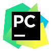

# Hello, This is <b>Sugat</b>

I am a student, but most importantly, a young passionate programmer and explorer of technology.

## Technologies I’ve worked with

### Languages
<p>
  
  
  
  
  
  
  
  
</p>

### Frameworks
<p>
  
  
  
  
  
  
</p>

### Databases
<p>
  
  
  
</p>

### Tools
<p>
  
  
  
  
  
  
  
  
</p>

> 🧠 Note: I'm a lifelong learner — this list is always growing (and occasionally shrinking)! Some of these I’m still learning or used briefly!

<br/>

## More about Me
```javascript
// More about Me

about_sugat = {
    type: "Self-trained (from YouTube, internet)",
    skills: "As above, and much more",
    learning: ["DSA", "Maths", "Chemistry", "Physics", "etc."],
    fascinating_things: [
        "Artificial Intelligence",
        "Quantum and/or Supercomputers",
        "Path Tracers and/or Game Engines",
        "The Open Source Community",
        "Every Cutie Powerful Transistor in my computers",
        "Video Games, because why not?",
        "etc."
    ],
    status: "Exploring Something"
};
