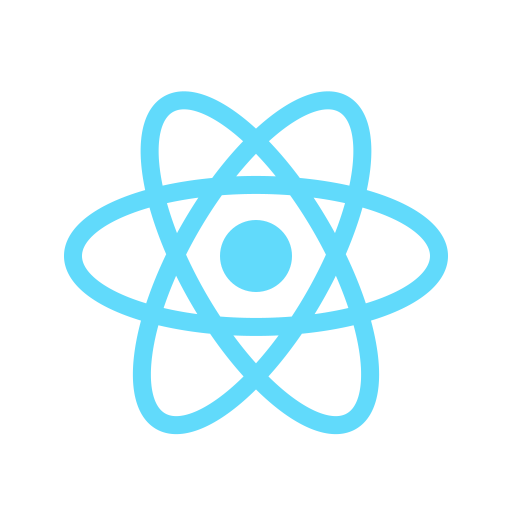
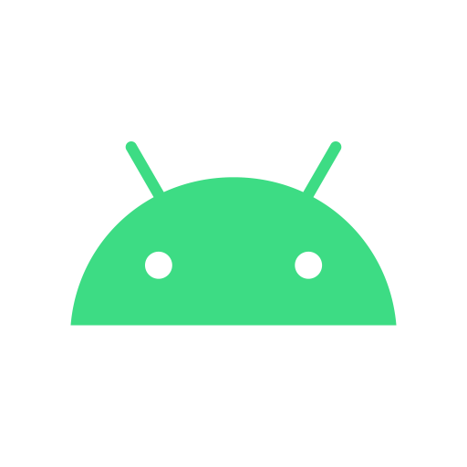
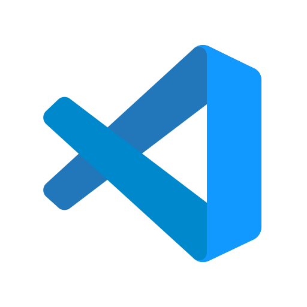
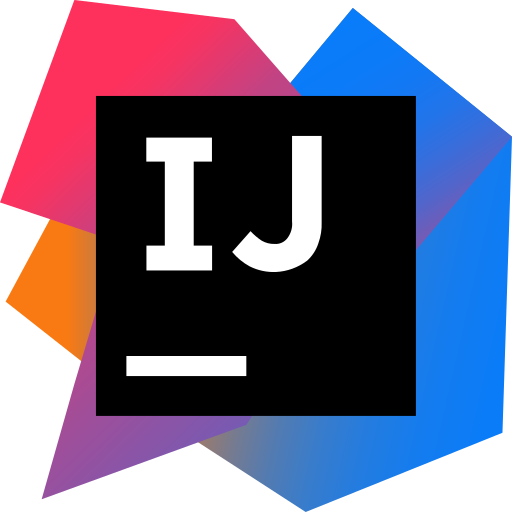

# Hello, This is <b>Sugat</b>

I am a student just to completed SSC class 10th, most important I am a passionate Programmer, Coder, etc.


## My Skills

### Languages
|<a></a> |<a></a> | <a></a> |<a></a> | <a></a> |<a></a> |<a></a> | <span height="40px" width="40px">Learning<br/>More</span> | 
|-|-|-|-|-|-|-|-|

### Frameworks
|<a></a> |<a></a> | <a></a> |<a></a> | <a></a> | Much<br/>More | 
|-|-|-|-|-|-|

### Tools
|<a></a> |<a></a> | <a></a> | <a></a> | Much<br/>More | 
|-|-|-|-|-|

#### Note : This all changes time to time.

<br/>

## More about Me
```javascript
// More about Me

about_sugat = {
    type : "self trained (from youtube, internet)",
    skills : "as above, and much more",
    learning : ["DSA", "Data Science",
                "Machine Learning", "etc."], 
    passionate_about : ["Artificial Intelligence","Satellites",
                    "Qunatum Computers", "Super Computers", "etc."], 
}
```
