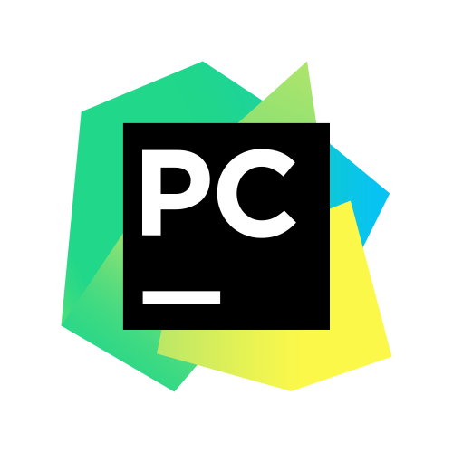

# Hello, This is <b>Sugat</b>

I am a student currently in high School, most important I am a passionate Programmer, Coder, etc.

## My Skills

### Languages
<p>
  
  
  
  
  
  
  
  
</p>

### Frameworks
<p>
  
  
  
  
  
</p>

### Tools

<p>
  
  
  
  
  
</p>

#### Note : I trying to learning much more. And this changes over time

<br/>

## More about Me
```javascript
// More about Me

about_sugat = {
    type : "self trained (from youtube, internet)",
    skills : "as above, and much more",
    learning : ["DSA", "Data Science",
                "Machine Learning", "etc."], 
    passionate_about : ["Artificial Intelligence","Satellites",
                    "Qunatum Computers", "Super Computers", "etc."], 
}
```
